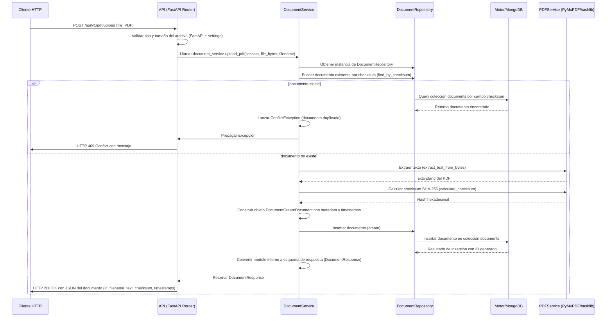

# PDF Extract AI Context

# Proyecto
- Nombre del proyecto: PDF Extract API
- Objetivo principal: Proveer una API REST para extraer texto de archivos PDF, evitar duplicados mediante checksum SHA-256 y almacenar resultados en MongoDB.
- Problema que resuelve: Extracción de texto de PDFs y gestión de documentos con detección de duplicados basada en hash, además de gestión de usuarios y autenticación JWT.
- Casos de uso:
  - Subir un PDF y extraer su texto.
  - Verificar si un PDF ya fue procesado (por checksum) para evitar almacenar duplicados.
  - Consultar, actualizar y eliminar documentos almacenados.
  - Registrarse, iniciar sesión y gestionar usuarios y roles.
  - Verificar el estado de salud del servicio y de la base de datos.

# Resumen Ejecutivo
PDF Extract API es una aplicación backend basada en FastAPI (Python 3.11) que expone endpoints REST para la carga, extracción y gestión de documentos PDF. Utiliza MongoDB como base de datos de documentos mediante el driver asíncrono Motor, y aplica un patrón de arquitectura limpia (Clean Architecture) con capas claramente separadas: API (routers), Servicios (lógica de negocio), Repositorios (acceso a datos), Modelos (estructuras de datos) y Esquemas (validación Pydantic). La autenticación se gestiona mediante JWT y la extracción de texto se realiza con PyMuPDF (fitz). La aplicación se distribuye mediante Docker Compose, incluye un sistema de migraciones personalizado y sigue prácticas de desarrollo como TDD, SOLID y los principios de los 12 factores.

# Stack Tecnológico
| Componente | Tecnología | Razón de uso |
|------------|------------|--------------|
| Lenguaje | Python 3.11 | Lenguaje moderno, rico ecosistema, excelente soporte para async y bibliotecas científicas. |
| Framework | FastAPI | Alto rendimiento, generación automática de documentación OpenAPI, inyección de dependencias basada en tipos. |
| Base de datos | MongoDB 7.0 | Almacenamiento flexible tipo documento, adecuado para guardar texto extraído y metadatos sin esquemas rígidos. |
| Driver async | Motor | Driver oficial asíncrono para MongoDB, permite operaciones no bloqueantes con FastAPI. |
| Gestor de paquetes | UV | Instalación y resolución de dependencias ultra rápida, compatibilidad con PEP 582 y workflows modernos. |
| Extracción PDF | PyMuPDF (fitz) | Biblioteca robusta y rápida para extraer texto, imágenes y metadatos de PDFs. |
| Autenticación | JWT (PyJWT) | Mecanismo stateless y ampliamente adoptado para autenticación stateless en APIs REST. |
| Contenedores | Docker + Docker Compose | Empaquetado reproducible y orquestación sencilla de servicios (app + MongoDB). |
| Logging | Loguru (via configuración custom) | Estructurado, JSON, con correlación de requests y niveles configurables. |
| Testing | Pytest | Framework de prueba ampliamente adoptado, con soporte para fixtures y parametrización. |
| Migraciones | Sistema custom (carpeta migrations) | Evita dependencias externas como Alembic, permite scripts async simples y control total sobre versiones. |
| Validación de datos | Pydantic | Validación, serialización y documentación automática de modelos de entrada y salida. |
| CORS | FastAPI CORS Middleware | Permite configurar fácilmente orígenes permitidos para frontend. |
| Seguridad | Passlib (hashing) + secrets | Hash seguro de contraseñas y generación de claves secretas. |

# Arquitectura
## Arquitectura General
La aplicación sigue una **Clean Architecture** (arquitectura limpia) con dependencias que apuntan hacia adentro: la capa más externa (API) depende de la capa de servicios, que depende de la capa de repositorios, que depende de la capa de modelos y de la conexión a la base de datos. Ninguna capa interna conoce detalles de las externas.

### Capas
1. **API (app/api)**: Define los routers de FastAPI, los endpoints, la validación de entrada mediante Pydantic y la traducción de respuestas. No contiene lógica de negocio.
2. **Servicios (app/services)**: Orquestan casos de uso, aplican reglas de negocio, coordinan entre repositorios y servicios externos (ej. extracción de PDF, cálculo de hash). No acceden directamente a la base de datos.
3. **Repositorios (app/repositories)**: Implementan el patrón Repository, encapsulan el acceso a Motor (MongoDB) y proporcionan métodos CRUD y de búsqueda específicos (como búsqueda por checksum).
4. **Modelos (app/models)**: Definen las estructuras de datos internas que se almacenan en MongoDB (usando Pydantic para validación y serialización). No son entidades de dominio complejas, sino DTOs adaptados al documento Mongo.
5. **Esquemas (app/schemas)**: Modelos Pydantic usados en la capa API para validar solicitudes y serializar respuestas; pueden diferir de los modelos internos.
6. **Core (app/core)**: Configuración centralizada (variables de entorno mediante Pydantic Settings), manejo de errores personalizados, seguridad (generación y verificación de JWT), logging estructurado y middlewares.
7. **DB (app/db)**: Inicializa y gestiona el cliente Motor, proporciona una sesión de base de datos mediante inyección de dependencias.
8. **Migrations (migrations/)**: Sistema de migraciones personalizado basado en scripts async con funciones `up(db)` y `down(db)`. El registro de migraciones aplicadas se guarda en una colección `_migration_log`.
9. **Utils (app/utils)**: Funciones auxiliares de bajo consumo (por ahora poco utilizado).

### Comunicación entre capas
- La **API** recibe una petición HTTP, valida los datos mediante los esquemas Pydantic, y llama a un método del **Service** correspondiente (inyectado mediante `Depends`).
- El **Servicio** recibe la sesión de base de datos (también inyectada) y crea una instancia del **Repositorio** necesario. Ejecuta lógica de negocio (validaciones, cálculo de checksum, llamada a servicios externos) y luego delega al repositorio la persistencia o consulta.
- El **Repositorio** utiliza el cliente Motor (`AsyncIOMotorDatabase`) para realizar operaciones en MongoDB y devuelve documentos crudos (diccionarios o modelos Pydantic internos).
- El **Servicio** convierte esos modelos internos a los esquemas de respuesta antes de devolverlos a la API.
- La **Configuración** y el **Logging** son transversales y se importan donde se necesitan.

### Ventajas
- **Separación de responsabilidades**: Cada capa tiene un solo motivo para cambiar.
- **Testabilidad**: Los servicios pueden unit‑testearse mockeando los repositorios; los repositorios pueden mockearse o usar una base de datos en memoria.
- **Mantenibilidad**: Cambios en la base de datos (por ejemplo, cambiar a otra ODM) solo afectan la capa de repositorios.
- **Escalabilidad**: El uso de Motor y la arquitectura sin estado permite escalan bien, La arquitectura impone una ligera sobrecarga de código (más clases e interfaces) pero compensa con claridad.

# Estructura del Proyecto
```
pdf_extractext/
├── app/                       # Código fuente de la aplicación
│   ├── api/                   # Capa de entrada HTTP (routers, endpoints)
│   │   └── v1/                # Versiónado de la API
│   │       ├── endpoints/     # Implementación de endpoints por recurso
│   │       │   ├── auth.py    # Login, obtener usuario actual
│   │       │   ├── health.py  # Endpoints de salud (live, ready, health)
│   │       │   ├── pdf.py     # Subida, listado, obtención, actualización y eliminación de PDFs
│   │       │   └── users.py   # CRUD de usuarios
│   │       └── router.py      # Agrupa todos los routers de la versión v1
│   ├── core/                  # Configuración transversal
│   │   ├── config.py          # Settings mediante Pydantic BaseSettings
│   │   ├── exceptions.py      # Excepciones personalizadas de la aplicación
│   │   ├── security.py        # Creación y verificación de tokens JWT, hash de contraseñas
│   │   └── logging/           # Configuración y middlewares de logging estructurado
│   ├── db/                    # Conexión a la base de datos
│   │   ├── database.py        # Cliente Motor y función de sesión
│   │   └── base.py            # (posiblemente base para modelos, actualmente poco usado)
│   ├── models/                # Modelos internos que representan documentos en MongoDB
│   │   ├── document.py        # Esquema del documento almacenado (filename, text, checksum, timestamps)
│   │   ├── role.py            # Modelo de rol (name, description)
│   │   ├── user.py            # Modelo de usuario (email, username, hashed_password, rol, timestamps)
│   │   └── __init__.py
│   ├── repositories/          # Acceso a datos mediante patrón Repository
│   │   ├── document_repo.py   # Métodos CRUD + búsqueda por checksum
│   │   ├── user_repository.py # CRUD de usuarios + búsqueda por email/username
│   │   └── role_repository.py # CRUD de roles
│   ├── services/              # Lógica de negocio y orquestación
│   │   ├── pdf_service.py     # Extracción de texto y cálculo de checksum (PyMuPDF, hashlib)
│   │   ├── document_service.py # Caso de uso de subida, listado, actualización, eliminación de documentos
│   │   ├── user_service.py    # Registro, autenticación, gestión de usuarios
│   │   ├── auth_service.py    # Creación y validación de tokens JWT, dependencias de seguridad
│   │   └── health_service.py  # Verificación de conectividad con MongoDB y estado del sistema
│   ├── schemas/               # Modelos Pydantic para validación y serialización API
│   │   ├── document.py        # Entrada/salida de documentos
│   │   ├── user.py            # Entrada/salida de usuarios
│   │   ├── auth.py            # Login, token response
│   │   ├── health.py          # Respuestas de health check
│   │   └── role.py            # Entrada/salida de roles
│   ├── main.py                # Factory de la aplicación FastAPI (application factory pattern)
│   └── __init__.py
├── migrations/                # Sistema de migraciones personalizado
│   ├── versions/              # Archivos de migración individuales (up/down)
│   ├── runner.py              # Ejecuta las migraciones pendientes
│   ├── registry.py            # Lleva registro de qué migraciones se han aplicado
│   ├── cli.py                 # Interfaz de línea de comandos para gestionar migraciones
│   └── __init__.py
├── tests/                     # Suite de pruebas (unitarias e integración)
│   ├── api/v1/                # Tests de endpoints HTTP
│   ├── services/              # Tests de lógica de servicios
│   ├── integration/
│   │   ├── core/              # Tests de middlewares y logging
│   │   └── db/                # Tests que requieren MongoDB real
│   ├── unit/
│   │   └── core/              # Tests de utilidades de logging, config, etc.
│   └── conftest.py            # Fixtures y configuración compartida de pytest
├── Dockerfile                 # Imagen de la aplicación (base python, copia de código, instalación de dependencias)
├── docker-compose.yml         # Orquesta app y servicio MongoDB
├── .env.example               # Plantilla de variables de entorno
├── .env                       # Variables de entorno reales (no versionado)
├── .gitignore                 # Archivos y carpetas a ignorar por Git
├── .python-version            # Versión de Python esperada (usado por uv/pyenv)
├── pyproject.toml             # Declaración de dependencias y metadata del proyecto (uso de uv)
└── uv.lock                    # Archivo de bloqueo de dependencias generado por uv
```

# Flujo General del Sistema
A continuación se describe el flujo típico desde que un usuario envía una solicitud HTTP hasta que recibe una respuesta, utilizando el endpoint de subida de PDF como ejemplo.

## Flujo de subida de PDF (POST /api/v1/pdf/upload)


## Otros flujos típicos
- **Autenticación (POST /api/v1/auth/login)**: El servicio de auth verifica credenciales contra el repositorio de usuarios, valida el hash de la contraseña y firma un JWT que se devuelve al cliente.
- **Obtener usuario actual (GET /api/v1/auth/me)**: Middleware de auth extrae el JWT del encabezado `Authorization`, lo decodifica y obtiene el usuario del repositorio.
- **Health check (GET /api/v1/health/)**: El servicio de salud verifica la conexión a MongoDB mediante un ping sencillo y devuelve estado `healthy` o `unhealthy`.

# Componentes Principales

## DocumentService (app/services/document_service.py)
- **Responsabilidad**: Orquestar el ciclo de vida de los documentos PDF: subir (con detección de duplicados), obtener, listar, actualizar y eliminar.
- **Dependencias**: 
  - `motor.motor_asyncio.AsyncIOMotorDatabase` (sesión de BD, inyectada)
  - `app.repositories.document_repo.DocumentRepository`
  - `app.services.pdf_service` (funciones de extracción y checksum)
  - `app.models.document` (modelos internos)
  - `app.schemas.document` (esquemas de respuesta)
  - `app.core.exceptions` (excepciones personalizadas)
- **Consume**: 
  - Bytes del archivo PDF y nombre de archivo desde la API.
  - Sesión de base de datos proporcionada por dependency injection.
- **Produce**: 
  - Objetos `DocumentResponse` listos para ser serializados como JSON.
  - Excepciones de dominio (`ConflictException`, `NotFoundException`) que la API traduce a códigos HTTP.
- **Interacción**: 
  - Recibe la sesión de la API vía `Depends(get_db_session)`.
  - Llama al repositorio para operaciones de lectura/escritura.
  - Utiliza `pdf_service` para extraer texto y calcular hash.
  - No conoce detalles de HTTP ni de la capa de API.

## PDFService (app/services/pdf_service.py)
- **Responsabilidad**: Extraer texto sin formato de un PDF y calcular su checksum SHA-256.
- **Dependencias**: 
  - `fitz` (PyMuPDF)
  - `hashlib`
  - `app.core.logging` (para registro estructurado)
- **Consume**: 
  - Bytes del archivo PDF.
- **Produce**: 
  - Texto extraído (string) o excepción `ValueError` si el PDF no es válido.
  - Hash hexadecimal de 64 caracteres.
- **Interacción**: 
  - Es llamado exclusivamente por `DocumentService` (puede reutilizarse en otros contextos).
  - No tiene conocimiento de la base de datos ni de la API.

## DocumentRepository (app/repositories/document_repo.py)
- **Responsabilidad**: Encapsular todo el acceso a la colección `documents` de MongoDB.
- **Dependencias**: 
  - `motor.motor_asyncio.AsyncIOMotorDatabase`
  - `app.models.document` (para convertir entre documentos Mongo y modelos internos)
- **Consume**: 
  - Sesión de base de datos.
  - Criterios de búsqueda (ID, checksum, filtros genéricos).
- **Produce**: 
  - Modelos internos (`DocumentDocument`, `DocumentCreateDocument`, etc.) o datos crudos según el método.
  - Booleanos para operaciones de eliminación/existencia.
- **Interacción**: 
  - Instanciado por los servicios mediante `self._get_repository(session)`.
  - No contiene lógica de negocio; solo traduce entre operaciones de Mongo y objetos de la aplicación.

## UserService & AuthService (app/services/user_service.py, auth_service.py)
- **Responsabilidad**: 
  - `UserService`: Registro, consulta, actualización y eliminación de usuarios; asignación de roles.
  - `AuthService`: Autenticación (verificación de credenciales, generación de tokens), recuperación del usuario actual desde token.
- **Dependencias**: 
  - Repositorios de usuario y rol.
  - Utilidades de hash de contraseñas (`passlib`).
  - Configuración de JWT (secreto, tiempo de expiración, algoritmo).
  - Modelos y esquemas de usuario.
- **Consume**: 
  - Datos de registro/login (email, username, password).
  - Tokens JWT para validación.
- **Produce**: 
  - Objetos de usuario (seguros, sin contraseña en texto plano).
  - Tokens de acceso (JWT) y refresco (si se implementa).
  - Excepciones de dominio (credenciales inválidas, usuario no encontrado, etc.).
- **Interacción**: 
  - Los endpoints de `/auth` y `/users` delegan a estos servicios.
  - El middleware de seguridad puede usar `AuthService` para obtener el usuario actual a partir del token.

## Database (app/db/database.py)
- **Responsabilidad**: Crear y gestionar el cliente Motor singleton y proporcionar una sesión de base de datos mediante dependency injection.
- **Dependencias**: 
  - `motor.motor_asyncio.AsyncIOMotorClient`
  - `app.core.config.settings` (URL y nombre de la base de datos)
- **Consume**: 
  - Variables de entorno `MONGODB_URL` y `MONGODB_DB_NAME`.
- **Produce**: 
  - Una instancia de `AsyncIOMotorDatabase` que representa la base de datos seleccionada.
- **Interacción**: 
  - Exportada como `db` y utilizada mediante `Depends(get_db_session)` en routers y servicios.

## Configuración (app/core/config.py)
- **Responsabilidad**: Cargar variables de entorno mediante Pydantic `BaseSettings`, proporcionar un único objeto de configuración inmutable.
- **Dependencias**: 
  - `pydantic.BaseSettings`
  - Variables de entorno definidas en `.env` o del sistema.
- **Consume**: 
  - Variables como `APP_NAME`, `MONGODB_URL`, `SECRET_KEY`, etc.
- **Produce**: 
  - Instancia `settings` accesible en toda la aplicación.
- **Interacción**: 
  - Importada en `main.py`, `database.py`, `security.py`, routers, etc.

# Base de Datos
## Modelo de datos
La aplicación utiliza MongoDB como almacén de documentos. Cada colección almacena documentos JSON-like (BSON) con los siguientes esquemas:

### Colección `documents`
| Campo | Tipo | Descripción |
|-------|------|-------------|
| `_id` | `ObjectId` (string en la API) | Identificador único generado por MongoDB |
| `filename` | `string` | Nombre original del archivo PDF |
| `text` | `string` | Texto extraído completo del PDF |
| `checksum` | `string` (hex, 64 chars) | SHA-256 del contenido del PDF (utilizado para detección de duplicados) |
| `created_at` | `datetime` (UTC) | Marca de tiempo de creación |
| `updated_at` | `datetime` (UTC) | Marca de tiempo de última actualización |

### Colección `users`
| Campo | Tipo | Descripción |
|-------|------|-------------|
| `_id` | `ObjectId` | Identificador único |
| `email` | `string` (único) | Correo electrónico del usuario |
| `username` | `string` (único) | Nombre de usuario |
| `hashed_password` | `string` | Hash bcrypt de la contraseña |
| `role_id` | `ObjectId` (referencia a `roles.id`) | Rol asignado al usuario |
| `created_at` | `datetime` | Fecha de creación |
| `updated_at` | `datetime` | Fecha de última actualización |

### Colección `roles`
| Campo | Tipo | Descripción |
|-------|------|-------------|
| `_id` | `ObjectId` | Identificador único |
| `name` | `string` (único) | Nombre del rol (ej. `admin`, `user`) |
| `description` | `string` | Descripción opcional del rol |

## Relaciones
- `users.role_id` → `roles._id` (referencia simple, no se aplican restricciones de integridad referencial a nivel de MongoDB; la aplicación garantiza la consistencia mediante lógica de servicio).
- No existen relaciones estructuradas entre documentos; cada documento es independiente.

## Índices
- **Colección `documents`**: Índice único en el campo `checksum` para asegurar que no haya dos documentos con el mismo hash (evita inserciones duplicadas a nivel de base de datos).
- **Colección `users`**: Índices únicos en `email` y `username`.
- **Colección `roles`**: Índice único en `name`.

## Validaciones
- A nivel de aplicación:
  - Los esquemas Pydantic validan tipos, longitudes mínimas/máximas y formato (por ejemplo, email).
  - El servicio de usuario verifica que la contraseña cumpla con política de longitud (si se implementa).
  - El servicio de documento valida que el archivo sea un PDF mediante extensión y tipo MIME, y luego mediante intento de apertura con PyMuPDF.
- A nivel de base de datos:
  - Índices únicos evitan duplicados de campos críticos.
  - El conductor Motor lanza excepciones si se intenta insertar un documento que viola un índice único.

## Modelos importantes
- `app.models.document.DocumentDocument`: representa el documento tal como se guarda en MongoDB.
- `app.models.user.User` y `app.models.role.Role`: análogos para las colecciones de usuarios y roles.
- Los esquemas Pydantic en `app/schemas/` definen los contratos de API (entrada y salida).

# API
## Organización
La API está versionada bajo el prefijo `/api/v1`. Cada recurso tiene su propio router dentro de `app/api/v1/endpoints/`. El archivo `app/api/v1/router.py` incluye todos los sub‑routers y se importa en `main.py`.

## Endpoints principales
| Método | Ruta | Descripción | Protección (Auth) |
|--------|------|-------------|-------------------|
| `POST` | `/api/v1/pdf/upload` | Sube un PDF, extrae texto, verifica duplicado por checksum y guarda el documento. | **Opcional** (actualmente no requiere autenticación; se puede añadir `Depends(get_current_user)` si se desea restringir) |
| `GET` | `/api/v1/pdf/` | Lista todos los documentos con paginación. | Opcional |
| `GET` | `/api/v1/pdf/{id}` | Obtiene un documento por su ID. | Opcional |
| `PUT` | `/api/v1/pdf/{id}` | Actualiza metadatos (filename) de un documento. | Opcional |
| `DELETE` | `/api/v1/pdf/{id}` | Elimina un documento por su ID. | Opcional |
| `POST` | `/api/v1/auth/login` | Autentica usuario y devuelve JWT access token. | Público |
| `GET` | `/api/v1/auth/me` | Obtiene datos del usuario autenticado (extraído del token). | Requiere JWT válido |
| `POST` | `/api/v1/users/` | Crea un nuevo usuario (registro). | Público (puede restringirse a admin) |
| `GET` | `/api/v1/users/` | Lista todos los usuarios (con paginación). | Requiere rol admin (por implementar) |
| `GET` | `/api/v1/users/{id}` | Obtiene un usuario por ID. | Requiere rol admin o propio usuario |
| `PUT` | `/api/v1/users/{id}` | Actualiza un usuario. | Requiere rol admin o propio usuario |
| `DELETE` | `/api/v1/users/{id}` | Elimina un usuario. | Requiere rol admin |
| `GET` | `/api/v1/health/` | Estado general de la aplicación y conexión a MongoDB. | Público |
| `GET` | `/api/v1/health/live` | Liveness probe (solo verifica que el proceso esté vivo). | Público |
| `GET` | `/api/v1/health/ready` | Readiness probe (verifica conexión a DB y otros servicios críticos). | Público |

## Flujo interno (ejemplo: login)
```mermaid
sequenceDiagram
    actor Usuario
    participant API as Auth Router
    servicio as AuthService
    repo as UserRepository
    db as MongoDB

    Usuario->>API: POST /api/v1/auth/login {email, password}
    API->>servicio: llamar auth_service.login(email, password, db_session)
    servicio->>repo: obtener usuario por email
    repo->>db: query collection users where email = ?
    db-->>repo: documento usuario (o null)
    repo-->>servicio: Usuario o None
    alt usuario no existe or contraseña incorrecta
        servicio->>servicio: verificar hash (bcrypt)
        servicio->>servicio: si falla lanzar InvalidCredentialsException
        servicio-->>API: excepción
        API-->>Usuario: HTTP 401 Unauthorized
    else credenciales válidas
        servicio->>servicio: crear access token (JWT) con sub=user.id, exp, etc.
        servicio-->>API: devolver token y opcionalmente refresh token
        API-->>Usuario: HTTP 200 OK con {access_token, token_type}
    end
```

## Autenticación
- Se utiliza **JWT** (JSON Web Token) con algoritmo HS256.
- El secreto se carga desde la variable de entorno `SECRET_KEY`.
- El token se envía en el encabezado `Authorization: Bearer <token>`.
- El middleware de autenticación (implícito en las dependencias de los endpoints protegidos) decodifica el token, extrae el `sub` (ID de usuario) y obtiene el usuario completo del repositorio; si falla, lanza `HTTPException 401`.

## Manejo de errores
- La aplicación define excepciones personalizadas en `app/core/exceptions.py` (por ejemplo, `NotFoundException`, `ConflictException`, `InvalidCredentialsException`).
- Los servicios lanzan estas excepciones cuando ocurre una condición de negocio.
- Los routers capturan esas excepciones mediante bloques `try/except` y las convierten en respuestas HTTP adecuadas con códigos de estado específicos (404, 409, 401, etc.).
- Las excepciones no capturadas provocan que FastAPI devuelva una respuesta 500 interna; sin embargo, se busca que todas las rutas de error esperadas estén controladas.

# Configuración
## Variables de entorno
El archivo `.env` (plantilla en `.env.example`) contiene las siguientes variables:

| Variable | Descripción | Valor por defecto (ejemplo) |
|----------|-------------|-----------------------------|
| `APP_NAME` | Nombre de la aplicación | `PDF Extract API` |
| `APP_VERSION` | Versión semántica | `1.0.0` |
| `DEBUG` | Habilita modo debug (Swagger UI, recarga) | `False` |
| `ENVIRONMENT` | Entorno de ejecución (`development`, `production`, `test`) | `development` |
| `MONGODB_URL` | URI de conexión a MongoDB | `mongodb://localhost:27017` |
| `MONGODB_DB_NAME` | Nombre de la base de datos | `pdf_extract_db` |
| `SECRET_KEY` | Clave secreta para firmar JWT | **(requerido, generar secreto fuerte)** |
| `LOG_LEVEL` | Nivel de logging (`DEBUG`, `INFO`, `WARNING`, `ERROR`, `CRITICAL`) | `INFO` |
| `LOG_FORMAT` | Formato de salida de logs (`json` o `text`) | `json` |
| `LOG_CORRELATION_ID` | Incluir ID de correlación en logs | `True` |
| `ALLOWED_HOSTS` | Lista de orígenes permitidos para CORS (separados por coma) | `*` (en desarrollo) |
| `MAX_UPLOAD_SIZE` | Tamaño máximo permitido para uploads de archivos (bytes) | `52428800` (50 MB) |

## Docker
El `Dockerfile` construye una imagen ligera basada en `python:3.11-slim`:
- Copia el código fuente.
- Instala dependencias mediante `uv sync --no-install-project --no-dev` (solo dependencias de producción).
- Expone el puerto `8000`.
- El punto de entrada ejecuta `uvicorn app.main:app --host 0.0.0.0 --port 8000`.

## Docker Compose
El archivo `docker-compose.yml` define dos servicios:
- `app`: construye la imagen del Dockerfile, monta el código (opcional en dev), establece variables de entorno desde `.env`, depende de `mongodb`.
- `mongodb`: usa la imagen oficial `mongo:7.0`, expone el puerto `27017`, volumen persistente `mongo_data`.

Para levantar el stack:
```bash
docker compose up --build          # primer levantamiento (construye imagen)
docker compose up -d               # en segundo plano
docker compose logs -f app         # ver logs en tiempo real
```

## Cómo levantar el proyecto (local sin Docker)
1. Instalar `uv` (gestor de paquetes) y asegurar Python 3.11.
2. Ejecutar `uv sync` para crear el entorno virtual y instalar dependencias.
3. Copiar `.env.example` a `.env` y ajustar los valores (especialmente `MONGODB_URL` si MongoDB no está local, y `SECRET_KEY`).
4. Asegurarse de que MongoDB esté corriendo y accesible en la URL indicada.
5. Arrancar la aplicación: `uvicorn app.main:app --reload`.
6. La API estará disponible en `http://localhost:8000` con documentación en `/api/docs`.

# Dependencias Importantes
| Dependencia | Propósito | Problema que resuelve |
|-------------|-----------|-----------------------|
| `fastapi` | Framework web async de alto rendimiento | Permite crear APIs rápidas con automática documentación OpenAPI y inyección de dependencias basada en tipos. |
| `uvicorn` | Servidor ASGI para servir aplicaciones FastAPI | Proporciona un servidor de producción ligero y rápido compatible con asyncio. |
| `motor` | Driver async de MongoDB para Python | Permite operaciones no bloqueantes contra MongoDB, esencial para mantener la capacidad de respuesta bajo carga. |
| `pymongo` (dependencia de motor) | Controlador síncrono de MongoDB | Necesario como base para Motor. |
| `pydantic` | Validación de datos y gestión de settings mediante tipificación | Garantiza que los datos de entrada y salida cumplan con los esquemas definidos; también gestiona la configuración mediante variables de entorno. |
| `passlib[bcrypt]` | Hash seguro de contraseñas | Almacena contraseñas de forma irrecoverable usando bcrypt, resistente a ataques de fuerza bruta. |
| `pyjwt` | Generación y verificación de tokens JSON Web | Implementa autenticación stateless basada en tokens firmados. |
| `fitz` (PyMuPDF) | Extracción de texto, imágenes y metadatos de PDFs | Biblioteca nativa (C) con excelente rendimiento y soporte amplio de características PDF. |
| `uv` | Gestor de paquetes y entornos virtuales acelerado | Reduce drásticamente el tiempo de instalación de dependencias y gestionar entornos aislados. |
| `loguru` (usado indirectamente mediante configuración custom) | Logging estructurado y configurable | Facilita el output en JSON, rotación y contexto (como correlation IDs). |
| `pytest` | Framework de pruebas | Permite escribir y ejecutar pruebas unitarias y de integración de forma sencilla. |
| `python-dotenv` (implícito en pydantic-settings) | Carga de variables de entorno desde archivo `.env` | Simplifica la configuración local y la separación de entornos. |

# Funcionalidades
## Implementadas
- **Extracción de texto de PDF** mediante PyMuPDF.
- **Cálculo de checksum SHA-256** para detección de duplicados.
- **Almacenamiento de documentos** en MongoDB con metadata (nombre, timestamps).
- **Prevención de duplicados** a nivel de aplicación y de base de datos (índice único en `checksum`).
- **CRUD completo de documentos** (crear, leer, listar, actualizar, eliminar).
- **Autenticación JWT** (login, obtención de usuario actual).
- **Gestión de usuarios** (creación, lectura, actualización, eliminación).
- **Gestión de roles** (asignación a usuarios, consulta).
- **Endpoints de salud** (liveness, readiness, general).
- **Logging estructurado** con correlación de requests.
- **Configuración centralizada** mediante Pydantic Settings.
- **Sistema de migraciones personalizado** (scripts async con registro de aplicación).
- **Dockerización** (Dockerfile + docker-compose.yml).
- **Tests unitarios** (≈99 passing según README) y tests de integración (requieren MongoDB).
- **Documentación automática** (Swagger UI en `/api/docs` cuando `DEBUG=true`).

## Parcialmente implementadas
- **Refresh token** (no se evidencia en el código; solo se menciona access token en login).
- **Control de acceso basado en roles (RBAC)**: los endpoints de usuarios parecen estar protegidos por rol admin en la documentación, pero la implementación actual no muestra verificaciones de rol en los servicios; probablemente esté planeado.
- **Rate limiting** (no presente).
- **Cifrado de datos en reposo** (no aplicado; se depende de la seguridad del entorno de MongoDB).
- **Webhooks o notificaciones** tras procesamiento de PDF (no presente).

## Pendientes
- **Implementar refresh token y rotación de tokens** para mejorar seguridad de sesiones.
- **Añadir middleware de rate limiting** (por ejemplo, usando `slowapi` o límite basado en Redis/IP).
- **Implementar políticas de retención y eliminación automática** de documentos antiguos o innecesarios.
- **Agregar métricas y tracing** (Prometheus, OpenTelemetry) para observabilidad en producción.
- **Soporte para almacenamiento de archivos grandes (GridFS)** si se requiere guardar el PDF original además del texto extraído.
- **Internacionalización (i18n)** de mensajes de error y respuestas API.
- **Mejorar la cobertura de pruebas de integración** para cubrir todos los endpoints y escenarios de error.
- **Implementar paginación con cursores** además de skip/limit para mejor rendimiento en colecciones grandes.
- **Agregar soporte para carga asíncrona de archivos grandes** (streaming) para evitar cargar todo el archivo en memoria.
- **Documentar y aplicar políticas de seguridad de cabeceras HTTP** (CSP, HSTS, etc.) mediante middlewares.

# Decisiones de Diseño
1. **Uso de MongoDB + Motor**  
   - *Motivo*: Flexibilidad para almacenar texto extraído sin esquema rígido, y capacidad de escalar horizontalmente. Motor permite aprovechar el rendimiento async de FastAPI sin bloquear el event loop.

2. **Arquitectura Limpia (Clean Architecture)**  
   - *Motivo*: Separar claramente las responsabilidades facilita el testing, el mantenimiento y la posibilidad de cambiar tecnologías (por ejemplo, sustituir MongoDB por otra base de datos) afectando solo la capa de repositorios.

3. **Sistema de migraciones custom**  
   - *Motivo*: Evitar una dependencia externa como Alembic (que está orientado a bases relacionales) y mantener la simplicidad dado que las migraciones son scripts async simples que operan sobre collections de MongoDB.

4. **Extracción de texto y checksum como funciones puras**  
   - *Motivo*: Facilita el testing unitario (sin necesidad de mocks complejos) y permite reutilizarlas en otros contextos (por ejemplo, jobs de batch).

5. **Autenticación JWT stateless**  
   - *Motivo*: Evita almacenar estado de sesión en el servidor, lo que simplifica la escalabilidad horizontal y reduce la dependencia de almacenes externos como Redis (aunque se podría añadir un blacklist de tokens revocados en el futuro).

6. **Uso de Pydantic tanto para settings como para validación de API**  
   - *Motivo*: Centraliza la definición de esquemas y reduce código boilerplate; la validación automática mejora la robustez de la API.

7. **Estructura de carpetas por tipo de cosa (controllers, services, repos, etc.) en lugar de por dominio**  
   - *Motivo*: El proyecto es relativamente pequeño y esta organización es común en aplicaciones FastAPI; sin embargo, a medida que crezca podría considerar agrupar por dominio (por ejemplo, módulos `documents`, `users`, `auth`).

8. **Manejo de errores mediante excepciones personalizadas**  
   - *Motivo*: Permite que los servicios expresen fallos de dominio sin conocer detalles de HTTP, y que los traduzcan a respuestas HTTP consistentes en la capa de API.

9. **Logging estructurado en JSON**  
   - *Motivo*: Facilita la ingestión en sistemas de agregación de logs (ELK, Splunk, etc.) y la correlación de requests mediante IDs.

10. **Docker y docker‑compose para desarrollo y producción**  
    - *Motivo*: Garantiza la reproducibilidad del entorno y simplifica la puesta en marcha de servicios dependientes (MongoDB).

# Convenciones del Proyecto
- **Organización del código**:  
  - Carpetas por tipo de responsabilidad (`api`, `core`, `db`, `models`, `repositories`, `services`, `schemas`).  
  - Cada capa tiene un propósito bien definido y las dependencias fluyen hacia adentro (las capas internas no conocen a las externas).

- **Convenciones de nombres**:  
  - Variables y funciones: `snake_case`.  
  - Clases: `PascalCase`.  
  - Constantes: `UPPER_SNAKE_CASE`.  
  - Archivos: `snake_case.py`.  
  - Rutas de API: kebab-case en las rutas (ej. `/pdf/upload`) y nombres de funciones en `snake_case`.

- **Estructura de carpetas**:  
  - El código fuente vive bajo `app/`.  
  - La configuración, migraciones y pruebas están en directorios separados en la raíz.  
  - Los archivos de configuración de infraestructura (`Dockerfile`, `docker-compose.yml`) están en la raíz.

- **Buenas prácticas utilizadas**:  
  - **Inyección de dependencias** mediante `Depends()` de FastAPI para servicios, repositorios y sesiones de base de datos.  
  - **Patrón Factory** para crear la aplicación (`create_application()` en `main.py`).  
  - **Uso de tipos anotados** (PEP 484) para mejorar la legibilidad y permitir chequeo estático con herramientas como `mypy` (aunque no se evidencia explícitamente su uso).  
  - **Manejo centralizado de configuración** mediante Pydantic `BaseSettings`.  
  - **Separación de lógica de negocio y transporte HTTP** (los servicios no conocen `Request` ni `Response`).  
  - **Tests automatizados** con alta cobertura (según el README, 99 tests unitarios passing).  
  - **Documentación automática** (Swagger UI) activada en modo debug.  
  - **Uso de variables de entorno** para configuración sensible yポート変更.  
  - **Git ignore** adecuado para evitar commit de archivos sensibles (`__pycache__`, `.env`, `.venv`, etc.).  

# Puntos Críticos
- **Carga completa de archivos en memoria**:  
  - En `pdf.py` el endpoint lee todo el archivo con `await file.read()`. Para archivos cercanos al límite (50 MB) esto puede consumir mucha memoria RAM bajo carga simultánea.  
  - **Riesgo**: OOM (out of memory) bajo tráfico alto.  
  - **Mitigación potencial**: implementar streaming de archivo a disco temporal o usar GridFS para almacenar el binario y procesarlo en chunks.

- **Unicidad de checksum basada solo en índice único**:  
  - Si dos archivos diferentes producen el mismo hash SHA-256 (colisión criptográfica extremadamente improbable pero teóricamente posible), se impedirá guardar el segundo.  
  - **Riesgo**: prácticamente nulo, pero vale la pena considerar un mecanismo de re‑hash o sal si se requiere resistencia a colisiones intencionales.

- **Falta de límite de tasa (rate limiting)**:  
  - Cualquier cliente puede intentar subir archivos o hacer login sin restricción, lo que podría llevar a abuso o agotamiento de recursos.  
  - **Riesgo**: denegación de servicio o incremento de costos en entornos cloud.

- **Seguridad de los tokens JWT**:  
  - El secreto se carga desde variable de entorno; si se fuga, los atacantes podrían firmar tokens arbitrarios.  
  - No se observa revocación de tokens ni lista negra; un token comprometido sería válido hasta su expiración.  
  - **Riesgo**: uso no autorizado de cuentas comprometidas hasta que expire el token.

- **Consistencia de datos entre colecciones (users ↔ roles)**:  
  - La relación se maneja solo a nivel de aplicación; no hay restricciones de foreign key en MongoDB. Si se elimina un rol mientras existen usuarios con ese rol, se produciría referencia huérfana.  
  - **Riesgo**: inconsistencias de datos si se elimina un rol sin reasignar o eliminar primero los usuarios dependientes.

- **Manejo de conexiones a MongoDB**:  
  - Se crea un cliente Motor singleton; si la URI de conexión es incorrecta o el servidor no está disponible, la aplicación fallará al iniciar (en el evento de startup).  
  - **Riesgo**: tiempo de arranque prolongado o fallo si la base de datos no está lista; sin embargo, el `lifespan` en `main.py` espera a que `db.connect()` tenga éxito antes de continuar.

- **Escalabilidad horizontal**:  
  - La aplicación es stateless (excepto por la dependencia en MongoDB), por lo que puede replicarse detrás de un balanceador de carga.  
  - **Limitación**: la base de datos MongoDB podría convertirse en cuello de botella si no se escala adecuadamente (sharding, réplicas).

# Mejoras Recomendadas
| Área | Mejora | Impacto | Dificultad | Beneficio Esperado |
|------|--------|---------|------------|--------------------|
| **Rendimiento / Escalabilidad** | Implementar streaming de uploads (guardar en disco temporal o usar GridFS) y procesar en chunks para evitar cargar archivos completos en RAM. | Alto | Media | Reduce consumo de memoria bajo carga simultánea de archivos grandes; permite subir archivos mayores al límite de RAM disponible. |
| **Seguridad** | Añadir refresh token con rotación y blacklist de tokens revocados (almacenados en Redis o colección dedicada). | Alto | Media | Mejora protección contra uso de tokens robados; permite invalidar sesiones sin esperar expiración. |
| **Seguridad** | Implementar rate limiting por IP y/o por endpoint (ej. 10 requests/segundo para login, 5 uploads/minuto por IP). | Medio | Baja | Mitiga abusos y ataques de fuerza bruta o denegación de servicio. |
| **Observabilidad** | Integrar métricas Prometheus (contadores de requests, latencias, errores) y tracing OpenTelemetry. | Medio | Baja | Facilita detección de cuellos de botella, monitoreo de salud y depuración en producción. |
| **Calidad de código** | Aplicar linting estricto (ruff, flake8) y formateo (black) en CI; añadir pre‑commit hooks. | Bajo | Baja | Mejora consistencia y reduce errores de estilo. |
| **Testing** | Ampliar pruebas de integración para cubrir rutas de error (por ejemplo, upload de archivo no PDF, token expirado, rol insuficiente). | Medio | Baja | Aumenta confianza en los cambios y reduce regresiones. |
| **Arquitectura** | Reorganizar código por dominio (módulos `documents`, `users`, `auth`) en lugar de por tipo técnico, a medida que el proyecto crezca. | Bajo | Media | Mejora mantenibilidad y escalabilidad organizacional cuando aparezcas más funcionalidades. |
| **Funcionalidad** | Soportar almacenamiento del archivo binario original (GridFS o bucket de objeto) además del texto extraído, para permitir reprocesamiento o extracción de metadatos adicionales. | Medio | Alta | Amplía los casos de uso (por ejemplo, extracción de imágenes, generación de thumbnails). |
| **Funcionalidad** | Implementar webhooks o eventos (por ejemplo, mediante Celery o RQ) para notificar a sistemas externos cuando un documento es procesado. | Bajo | Media | Permite integración con otros servicios sin acoplamiento directo. |
| **Documentación** | Generar documentación estática (por ejemplo, con MkDocs) además de Swagger, incluyendo guías de deployment y arquitectura. | Bajo | Baja | Mejora la incorporación de nuevos desarrolladores y la transferencia de conocimiento. |
| **Integración continua** | Añadir pipeline CI (GitHub Actions) que ejecute lint, tests, build de imagen Docker y despliegue en entorno de staging. | Medio | Media | Garantiza calidad y entrega continua. |

# Roadmap Técnico
1. **Corto plazo (1‑4 semanas)**  
   - Implementar rate limiting básico (por IP) usando una dependencia ligera como `slowapi`.  
   - Añadir pruebas de integración para escenarios de error en upload y autenticación.  
   - Ejecutar linting y formateo automático en CI.  
   - Documentar el proceso de despliegue y variables de entorno críticas en `README.md` (más allá de lo existente).

2. **Mediano plazo (1‑3 meses)**  
   - Diseñar e implementar sistema de refresh token y blacklist sencilla (colección MongoDB o Redis).  
   - Agregar métricas Prometheus y endpoint `/metrics`.  
   - Evaluar y probar almacenamiento de archivos binarios en GridFS para futuras necesidades de reprocesamiento.  
   - Revisar y posiblemente reforzar la validación de roles en endpoints de usuarios (middleware o dependencias).  
   - Realizar carga de prueba (locust/k6) para identificar límites actuales y validar mejoras de streaming.

3. **Largo plazo (3‑6 meses)**  
   - Refactorizar estructura de código hacia organización por dominio (carpetas `domains/documents`, `domains/users`, etc.) si el proyecto sigue creciendo.  
   - Implementar sistema de notificaciones (email, webhook) basado en eventos de carga/actualización de documentos.  
   - Considerar adopción de una plataforma de orquestación (Kubernetes) con Helm charts para despliegue escalable.  
   - Añadir soporte para múltiples proveedores de almacenamiento de objetos (S3, MinIO) mediante abstracción.  
   - Realizar auditoría de seguridad (OWASP ASVS) y aplicar mejoras recomendadas (CSP, HSTS, tasa de hash de contraseñas adaptativa, etc.).  

# Resumen para IA
**Contexto Rápido para IA**

- **Proyecto**: PDF Extract API – API REST para extraer texto de PDFs, evitar duplicados mediante checksum SHA‑256 y gestionar usuarios/roles con autenticación JWT.  
- **Tecnologías clave**: Python 3.11, FastAPI, Motor (async MongoDB driver), MongoDB 7.0, PyMuPDF (fitz), Passlib, PyJWT, UV (gestor de paquetes), Docker + Docker‑Compose, Pydantic (settings y validación), pytest.  
- **Arquitectura**: Clean Architecture con capas claramente separadas – API (routers), Servicios (lógica de negocio), Repositorios (acceso a Mongo mediante patrón Repository), Modelos (estructuras internas de documentos/usuarios/roles), Esquemas (Pydantic para I/O de API), Core (configuración, seguridad, logging), DB (cliente Motor singleton), Migraciones custom (scripts async con registro).  
- **Flujo típico de request** (ejemplo upload PDF):  
  1. Cliente envía PDF a `POST /api/v1/pdf/upload`.  
  2. API valida tipo/tamaño, llama a `DocumentService.upload_pdf`.  
  3. Servicio calcula SHA‑256, verifica existencia en `DocumentRepository` (índice único).  
  4. Si no existe, extrae texto con `pdf_service.extract_text_from_bytes`.  
  5. Crea documento con metadatos y lo inserta vía repositorio.  
  6. Servicio devuelve `DocumentResponse`; API lo serializa como JSON 200 OK.  
- **Puntos de extensión**: rate limiting, refresh tokens, mésticas, almacenamiento de archivos binarios (GridFS), organización por dominio, pruebas de integración ampliadas.  
- **Consideraciones críticas**: carga completa de archivos en memoria (posible bajo alta carga), falta de rate limiting, dependencia única del secreto JWT, consistencia de relaciones usuarios‑roles a nivel de aplicación.  
- **Cómo iniciar el proyecto**:  
  - Con Docker: `docker compose up --build` → levantar app y MongoDB.  
  - Local: instalar `uv`, `uv sync`, configurar `.env`, asegurar MongoDB corriendo, ejecutar `uvicorn app.main:app --reload`.  
  - Acceder a la documentación interactiva en `http://localhost:8000/api/docs` (si `DEBUG=true`).  

Este resumen proporciona a otra IA la información esencial para comprender la arquitectura, los componentes principales, los flujos de datos y los puntos de extensión necesarios para contribuir o extender el proyecto sin necesidad de examinar el código fuente línea por línea.